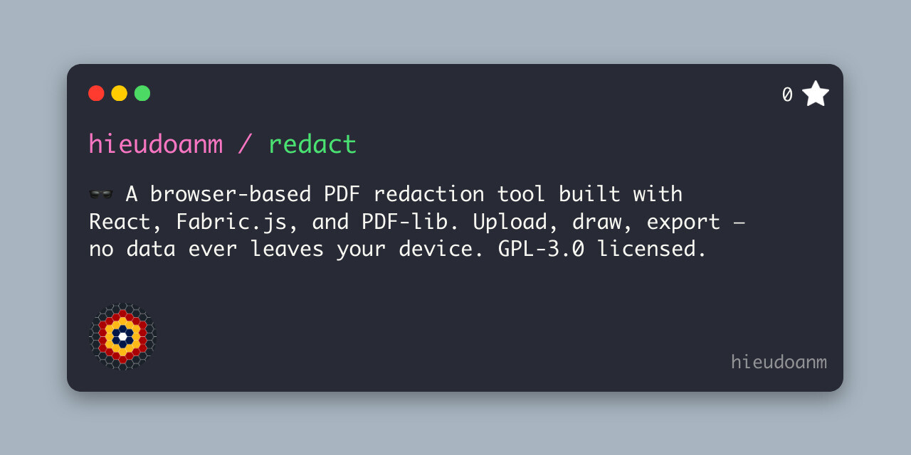

# 🕶️ Re(d)act

A simple, interactive **PDF redaction tool** built with React, Fabric.js, and PDF-lib. Click, draw, redact — all in your browser.



---

## 📚 Table of Contents

- [🕶️ Re(d)act](#️-redact)
  - [📚 Table of Contents](#-table-of-contents)
  - [🎬 Demo](#-demo)
  - [✨ Features](#-features)
  - [🛠️ Tech Stack](#️-tech-stack)
  - [🚀 Getting Started](#-getting-started)
  - [🧑‍💻 Usage](#-usage)
  - [📄 License](#-license)

---

## 🎬 Demo


---

## ✨ Features

- 📄 Upload any PDF file
- 🖱️ Draw black redaction boxes with your mouse
- ⬅️ Undo the last redaction
- 💾 Export a redacted version of the original PDF
- 🖥️ Works entirely in-browser — no uploads, no privacy risk

---

## 🛠️ Tech Stack

- **React** — UI Framework
- **Next.js** — App framework with file-based routing
- **TypeScript** — Type-safe development
- **Fabric.js** — Interactive canvas for redactions
- **PDF-lib** — Modify PDF pages and save new versions
- **react-pdf** — Render PDFs in the browser
- **file-saver** — Download redacted files

---

## 🚀 Getting Started

```bash
pnpm install
pnpm dev
```

Then open [http://localhost:3000](http://localhost:3000) in your browser.

📝 Make sure you copy the pdf.worker.min.js to public/workers/ if needed:

```bash
mkdir -p public/workers
cp node_modules/pdfjs-dist/build/pdf.worker.min.mjs public/workers/pdf.worker.min.js
```

## 🧑‍💻 Usage

Upload a .pdf file

Draw black boxes over the parts you want to redact

Click Export to download a redacted version

## 📄 License

This project is licensed under the GNU General Public License v3.0 (GPL-3.0).

You may use, modify, and share it under the terms of this license. See LICENSE for details.
